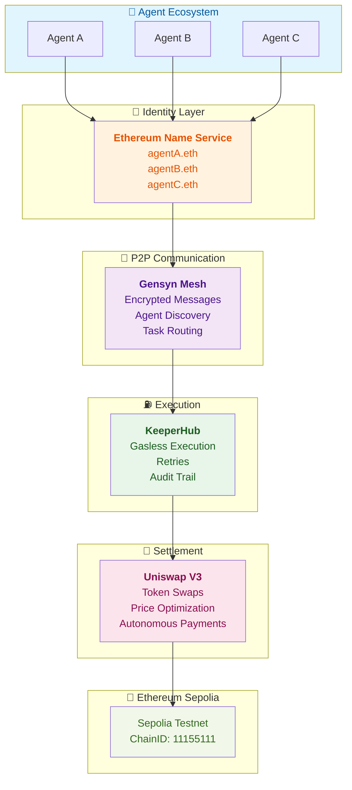

# AgentVerify

**Trust Layer for AI Agents** — ENS Identity + Peer-to-Peer Communications + Reliable Execution + Autonomous Payments

[](https://opensource.org/licenses/MIT)
[](https://sepolia.etherscan.io)
[](https://ethglobal.com)

---

## 🎯 **One-Line Pitch**

AI agents that can't be impersonated, find each other securely, execute onchain actions reliably, and pay each other autonomously.

---

## 🏗️ **Architecture**

AgentVerify is built on four pillars:



### **How It Works:**

1. **Identity (ENS)** — Each agent owns a `.eth` name with capabilities & reputation
2. **Discovery (AXL)** — Agents find each other via encrypted P2P mesh
3. **Execution (KeeperHub)** — Agents trigger onchain actions reliably
4. **Settlement (Uniswap)** — Agents pay each other in any token autonomously

---

## ✨ **Features**

### 🎯 **ENS Identity**
- Each agent owns a `.eth` name (e.g., `agentA.eth`)
- Capabilities and reputation stored as ENS text records
- Other agents resolve ENS name → verify identity + fetch metadata
- **No impersonation possible**

### 🔐 **AXL P2P Messaging**
- Agents discover each other via AXL mesh (Gensyn)
- Encrypted peer-to-peer task communication
- No central server — fully decentralized
- **Trustless agent-to-agent coordination**

### ⛽ **KeeperHub Execution**
- Agents trigger onchain actions via KeeperHub
- No manual gas management — handled automatically
- Automatic retries + MEV protection
- Full audit trail of executions
- **Agents never handle gas themselves**

### 💱 **Uniswap Settlement**
- When Agent A pays Agent B, settlement happens via Uniswap V3
- Autonomous token swaps (USDC → DAI, etc.)
- Recipients get tokens directly to their wallet
- ENS reputation scores update automatically
- **Autonomous agent-to-agent payments**

---

## 🚀 **Quick Start**

### Prerequisites
- Node.js 18+
- Sepolia testnet wallet with ≥ 0.5 ETH
- [Alchemy RPC key](https://www.alchemy.com) (or similar provider)

### Installation

```bash
# 1. Clone repo
git clone https://github.com/tusharshah21/Agent-Verify.git
cd agentverify

# 2. Install dependencies
npm install

# 3. Set up environment
cp .env.example .env.local
# Fill in your Sepolia RPC and wallet details

# 4. Start dev server
npm run dev

# 5. Open dashboard
# http://localhost:3000
```

### Run Tests

```bash
# CP0: Environment validation
node test-cp0.js

# CP1: ENS Identity System
node test-cp1.js

# CP2: AXL P2P Messaging
node test-cp2.js
```

---

## 🧪 **Local Testing Guide (CP4)**

### **Step 1: Run Unit Tests**
```bash
# CP4: Uniswap Settlement
node test-cp4.js
# Expected: ✅ PASSED: 20/20 (100% passing)

# CP3: KeeperHub Execution
node test-cp3.js
# Expected: ✅ PASSED: 18/18 (100% passing)

# CP2: AXL P2P Messaging
node test-cp2.js
# Expected: ✅ PASSED: 11/12 (one expected state issue)
```

### **Step 2: Start Development Server**
```bash
npm run dev
# Ready at http://localhost:3000
```

### **Step 3: Test API Endpoints (New Terminal)**

**Test 3A: Keeper Queue Statistics**
```bash
curl "http://localhost:3000/api/agent/execute?action=stats"

# Expected response:
# {
#   "success": true,
#   "stats": {
#     "total": 5,
#     "queued": 4,
#     "executing": 0,
#     "completed": 1,
#     "failed": 0,
#     "confirming": 0
#   }
# }
```

**Test 3B: Register Keeper Account**
```bash
curl -X POST http://localhost:3000/api/agent/execute \
  -H "Content-Type: application/json" \
  -d '{
    "action": "registerAccount",
    "walletAddress": "0xf866683E1eC4a62503C0128413EA0269E2A397d4"
  }'

# Expected: 201 Created
# {
#   "success": true,
#   "accountId": "keeper-xxxx",
#   "walletAddress": "0xf866683E1eC4a62503C0128413EA0269E2A397d4",
#   "balance": 5.0,
#   "status": "ACTIVE"
# }
```

**Test 3C: Schedule Execution**
```bash
curl -X POST http://localhost:3000/api/agent/execute \
  -H "Content-Type: application/json" \
  -d '{
    "action": "scheduleExecution",
    "taskId": "task-123",
    "agentAddress": "0xf866683E1eC4a62503C0128413EA0269E2A397d4",
    "onchainAction": "confirmCompletion",
    "params": {"gasLimit": 100000}
  }'

# Expected: 201 Created
# {
#   "success": true,
#   "taskId": "task-123",
#   "status": "QUEUED",
#   "keeper": "keeper-xxxx"
# }
```

**Test 3D: Poll Task Status**
```bash
curl "http://localhost:3000/api/agent/execute?taskId=task-123"

# Expected: 200 OK
# {
#   "success": true,
#   "taskId": "task-123",
#   "status": "QUEUED",
#   "progress": "10%",
#   "attempts": 0,
#   "maxAttempts": 3
# }
```

**Test 3E: Get All Keeper Accounts**
```bash
curl "http://localhost:3000/api/agent/execute?action=accounts"

# Returns list of all registered keeper accounts
```

### **Step 4: Check Server Logs**

In the `npm run dev` terminal, watch for:
- ✅ "Registered [Agent] in mesh"
- ✅ "Task sent from [Agent] to..."  
- ✅ "Message delivered"

### **Step 5: Verify Message Storage**

```bash
# View persisted messages
cat agent/axl_messages.json
```

---

## � **Checkpoint Progress**

| CP | Phase | Duration | Status | What's Done |
|----|-------|----------|--------|-------------|
| **CP0** | Environment Setup | 2h | ✅ **COMPLETE** | RPC, wallet, config, validation |
| **CP1** | ENS Identity System | 4h | ✅ **COMPLETE** | Agent registration, resolution, 6/6 tests |
| **CP2** | AXL P2P Messaging | 6h | ✅ **COMPLETE** | Agent discovery, encrypted tasks, 11/12 tests |
| **CP3** | KeeperHub Execution | 4h | ✅ **COMPLETE** | Gasless execution, retries, 18/18 tests, locally tested |
| **CP4** | Uniswap Settlement | 4h | ✅ **COMPLETE** | Token swaps, agent payments, 20/20 tests |
| **CP5** | Dashboard UI | 8h | ⏳ **NEXT** | Agent management, task history |
| **CP6** | Final Demo | 8h | ⏳ Planned | Testing, bug fixes, submission |

**Current Progress:** 20/36 hours (56%) — **5/7 checkpoints complete** ✅

---

## 🏆 **Hackathon Tracks**

AgentVerify is competing for:

- 🥇 **ENS** — Best Integration for AI Agents ($1,250)
- 🥇 **AXL (Gensyn)** — Best Application ($1,500–$2,500)
- 🥇 **KeeperHub** — Best Use ($500–$1,500) + Feedback Bounty ($250)
- 🥇 **Uniswap** — Best API Integration ($1,000–$1,500)

**Realistic Prize Range:** $4,500 – $7,000

---

## 📁 **Project Structure**

```
agentverify/
├── agent/
│   ├── agentIdentity.js      # ENS registration + resolution
│   ├── axlMessenger.js       # AXL P2P comms (CP2)
│   ├── keeperExecutor.js     # KeeperHub execution (CP3)
│   ├── uniswapBridge.js      # Uniswap settlement (CP4)
│   ├── registry.json         # Local agent registry
│   └── debug.json            # Debug logs
│
├── pages/
│   ├── api/
│   │   ├── agent/
│   │   │   ├── register.js   # POST /api/agent/register
│   │   │   ├── resolve.js    # GET|POST /api/agent/resolve
│   │   │   ├── discover.js   # GET /api/agent/discover (CP2)
│   │   │   ├── execute.js    # POST /api/agent/execute (CP3)
│   │   │   └── settle.js     # POST /api/agent/settle (CP4)
│   │   └── ...
│   ├── dashboard.js          # Main dashboard (CP5)
│   ├── _app.js
│   └── index.js
│
├── components/
│   ├── AgentDashboard.js     # Main container (CP5)
│   ├── AgentList.js          # Online agents
│   ├── TaskFeed.js           # Task history
│   ├── ReputationCard.js     # Reputation scores
│   └── AXLMessageFeed.js     # Message log
│
├── config/
│   ├── sepolia.js            # Testnet config
│   └── contracts.json        # ABI references
│
├── styles/
│   ├── globals.css
│   └── Home.module.css
│
├── test-cp1.js               # CP1 unit tests
├── test-cp0.js               # CP0 validation tests
├── .env.example              # Environment template
├── .env.local                # Local secrets (gitignored)
├── package.json
└── README.md
```

---

## 🔌 **API Routes**

### Agent Identity (CP1)

```bash
# Register a new agent
POST /api/agent/register
{
  "agentName": "agentA",
  "agentAddress": "0x1234..."
}

# Resolve agent by name
GET /api/agent/resolve?name=agentA.eth

# List all agents
GET /api/agent/resolve

# Update agent metadata
POST /api/agent/resolve
{
  "name": "agentA.eth",
  "capabilities": { "swap": true, "execute": true },
  "reputation": 150
}
```

### Agent Discovery (CP2 — ✅ Complete)

```bash
# Discover agents in the mesh
GET /api/agent/discover
GET /api/agent/discover?capability=swap
GET /api/agent/discover?status=online&limit=5

# Response:
{
  "success": true,
  "count": 3,
  "agents": [
    {
      "name": "AgentA",
      "address": "0xf866683E1eC4a62503C0128413EA0269E2A397d4",
      "capabilities": { "execute": true, "swap": true, "bridge": true },
      "status": "online",
      "lastSeen": 1719576000000
    }
  ],
  "meshStatus": {
    "meshId": "agentverify-hackathon-2024",
    "nodeId": "2e1eefc8...",
    "agentsOnline": 3,
    "pendingMessages": 1
  }
}
```

### Task Messaging (CP2 — ✅ Complete)

```bash
# Send encrypted task to agent
POST /api/agent/task/send
{
  "fromAgentName": "AgentA",
  "fromAgentAddress": "0xf866683E1eC4a62503C0128413EA0269E2A397d4",
  "toAgentAddress": "0x1234567890123456789012345678901234567890",
  "task": {
    "action": "swap",
    "fromToken": "USDC",
    "toToken": "DAI",
    "amount": "100",
    "slippage": 0.5
  },
  "priority": "high",
  "ttl": 3600000
}

# Response:
{
  "success": true,
  "messageId": "8f703f09...",
  "status": "queued",
  "timestamp": 1719576000000,
  "expiresAt": 1719579600000
}

# Fetch messages for agent
GET /api/agent/task/fetch?agentAddress=0x1234567890123456789012345678901234567890

# Response:
{
  "success": true,
  "agentAddress": "0x1234...",
  "count": 2,
  "messages": [
    {
      "id": "8f703f09...",
      "from": "AgentA",
      "fromAddress": "0xf866...",
      "type": "task",
      "priority": "high",
      "encrypted": false,
      "timestamp": 1719576000000,
      "content": { "action": "swap", ... }
    }
  ]
}
```

### Execution (CP3 — ✅ Complete)

**Register Keeper Account**
```bash
POST /api/agent/execute
{
  "action": "registerAccount",
  "walletAddress": "0xf866683E1eC4a62503C0128413EA0269E2A397d4"
}

# Response:
{
  "success": true,
  "accountId": "keeper-83f638e4-3aa2-49b8-bdc3-529f709e3ff3",
  "walletAddress": "0xf866683E1eC4a62503C0128413EA0269E2A397d4",
  "balance": 5.0,
  "status": "ACTIVE"
}
```

**Schedule Execution Task**
```bash
POST /api/agent/execute
{
  "action": "scheduleExecution",
  "taskId": "test-task-123",
  "agentAddress": "0xf866683E1eC4a62503C0128413EA0269E2A397d4",
  "onchainAction": "confirmCompletion",
  "params": {
    "gasLimit": 100000
  }
}

# Response:
{
  "success": true,
  "taskId": "test-task-123",
  "status": "QUEUED",
  "keeper": "keeper-83f638e4-3aa2-49b8-bdc3-529f709e3ff3"
}
```

**Execute Onchain**
```bash
POST /api/agent/execute
{
  "action": "executeTask",
  "taskId": "test-task-123"
}

# Response:
{
  "success": true,
  "taskId": "test-task-123",
  "txHash": "0x1234abcd...",
  "status": "EXECUTING"
}
```

**Get Task Status**
```bash
GET /api/agent/execute?taskId=test-task-123

# Response:
{
  "success": true,
  "taskId": "test-task-123",
  "status": "QUEUED",
  "progress": "10%",
  "attempts": 0,
  "maxAttempts": 3,
  "createdAt": "2026-04-28T17:54:26.883Z"
}
```

**Get Queue Statistics**
```bash
GET /api/agent/execute?action=stats

# Response:
{
  "success": true,
  "stats": {
    "total": 5,
    "queued": 4,
    "executing": 0,
    "completed": 1,
    "failed": 0,
    "confirming": 0
  }
}
```

**List Keeper Accounts**
```bash
GET /api/agent/execute?action=accounts

# Response:
{
  "success": true,
  "count": 2,
  "accounts": [
    {
      "accountId": "keeper-83f638e4-3aa2-49b8-bdc3-529f709e3ff3",
      "walletAddress": "0xf866683E1eC4a62503C0128413EA0269E2A397d4",
      "balance": 5.0,
      "status": "ACTIVE",
      "tasksExecuted": 5,
      "successRate": "100%"
    }
  ]
}
```

### Settlement (CP4 — ✅ Complete)

**Get Swap Quote**
```bash
GET /api/agent/settle?action=quote&fromToken=USDC&toToken=DAI&amount=100&slippage=0.5

# Response:
{
  "success": true,
  "quote": {
    "quoteId": "quote-xxxx",
    "fromToken": "USDC",
    "toToken": "DAI",
    "amountIn": "100",
    "amountOut": "99.98",
    "amountOutMin": "99.48",  # With 0.5% slippage
    "exchangeRate": "0.9998",
    "priceImpact": "0.30",    # Uniswap V3 fee
    "feeAmount": "0.30",
    "netAmountOut": "99.68",
    "expiresIn": 30000
  }
}
```

**Execute Swap**
```bash
POST /api/agent/settle
{
  "action": "executeSwap",
  "fromToken": "USDC",
  "toToken": "DAI",
  "amount": "100",
  "recipientAddress": "0xf866683E1eC4a62503C0128413EA0269E2A397d4",
  "slippage": 0.5
}

# Response: 201 Created
{
  "success": true,
  "swapId": "swap-xxxx",
  "status": "EXECUTING",
  "txHash": "0x1234abcd...",
  "amountOut": "99.98",
  "fee": "0.30"
}
```

**Execute Agent Payment**
```bash
POST /api/agent/settle
{
  "action": "executePayment",
  "fromAgentAddress": "0xf866683E1eC4a62503C0128413EA0269E2A397d4",
  "toAgentAddress": "0x1234567890123456789012345678901234567890",
  "paymentToken": "USDC",
  "amount": "100",
  "swapToToken": "DAI"  # Optional: swap before sending
}

# Response: 201 Created
{
  "success": true,
  "paymentId": "payment-xxxx",
  "status": "EXECUTING",
  "txHash": "0x5678ef...",
  "finalAmount": "99.98"
}
```

**Get Settlement Statistics**
```bash
GET /api/agent/settle?action=stats

# Response:
{
  "success": true,
  "totalSwaps": 5,
  "completedSwaps": 3,
  "failedSwaps": 0,
  "pendingSwaps": 2,
  "totalVolume": "500.00",
  "successRate": "100",
  "averageSwapSize": "100.00"
}
```

**Get Settlement History**
```bash
GET /api/agent/settle?action=history&limit=10&offset=0

# Response:
{
  "success": true,
  "count": 5,
  "total": 5,
  "totalVolume": "500.00",
  "totalSwaps": 5,
  "successRate": "100",
  "settlements": [
    {
      "id": "swap-xxxx",
      "type": "TOKEN_SWAP",
      "fromToken": "USDC",
      "toToken": "DAI",
      "amount": "100",
      "status": "EXECUTING",
      "txHash": "0x1234...",
      "createdAt": "2026-04-29T..."
    }
  ]
}
```

**Get Swap Status**
```bash
GET /api/agent/settle?swapId=swap-xxxx

# Response:
{
  "success": true,
  "swapId": "swap-xxxx",
  "type": "TOKEN_SWAP",
  "status": "EXECUTING",
  "fromToken": "USDC",
  "toToken": "DAI",
  "amountIn": "100",
  "amountOut": "99.98",
  "txHash": "0x1234abcd...",
  "createdAt": "2026-04-29T...",
  "updatedAt": "2026-04-29T..."
}
```

---

## 🧪 **Testing**

### Run All Tests

```bash
npm test
```

### Run Specific Checkpoint Tests

```bash
# CP0: Environment validation
node test-cp0.js

# CP1: ENS Identity
node test-cp1.js

# CP2: AXL P2P (coming soon)
node test-cp2.js
```

---

## 📖 **How It Works**

### Step-by-Step Breakdown:

1. **IDENTITY** 🎫
   - Agent A resolves `agentB.eth` via ENS
   - Gets agentB's address + capabilities
   - Verifies agentB can handle swaps

2. **COMMUNICATION** 🔐
   - Agent A sends encrypted task message via AXL mesh
   - "Swap 100 USDC → DAI, send to my wallet"
   - Message is peer-to-peer, fully encrypted
   - Agent B receives it securely

3. **EXECUTION** ⛽
   - Agent B calls KeeperHub
   - "Execute this swap transaction"
   - KeeperHub handles gas, retries, MEV protection
   - Transaction confirmed onchain

4. **SETTLEMENT** 💱
   - Agent B calls Uniswap V3
   - "Swap 100 USDC for DAI"
   - Uniswap executes swap optimally
   - DAI sent directly to Agent A's wallet

5. **REPUTATION** ⭐
   - Agent B updates its ENS text record
   - "reputation: 101"
   - Other agents see the updated score
   - Trust increases for future interactions

---

## 🛠️ **Environment Variables**

See [.env.example](.env.example) for complete list.

**Required for running locally:**

```bash
NEXT_PUBLIC_SEPOLIA_RPC=https://sepolia.infura.io/v3/YOUR_KEY
SEPOLIA_PRIVATE_KEY=0x...
SEPOLIA_PUBLIC_KEY=0x...
```

---

## 📝 **License**

MIT License — See [LICENSE](./LICENSE) file

---

## 🤝 **Contributing**

Contributions welcome! Please:

1. Fork the repository
2. Create a feature branch (`git checkout -b feature/amazing-feature`)
3. Commit changes (`git commit -m 'Add amazing feature'`)
4. Push to branch (`git push origin feature/amazing-feature`)
5. Open a Pull Request

---

## 🎉 **Acknowledgments**

- [ENS](https://ens.domains/) — Agent identity
- [AXL (Gensyn)](https://gensyn.ai/) — P2P messaging
- [KeeperHub](https://keeperhub.io/) — Reliable execution
- [Uniswap](https://uniswap.org/) — Token settlement
- [ETH Global](https://ethglobal.com/) — Hackathon platform

---

**Built with ❤️ for the ETH Global Hackathon**
