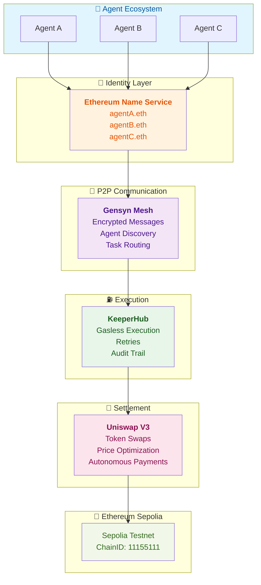

# AgentVerify

**Trust Layer for AI Agents** — ENS Identity + Peer-to-Peer Communications + Reliable Execution + Autonomous Payments

[](https://opensource.org/licenses/MIT)
[](https://sepolia.etherscan.io)
[](https://ethglobal.com)

---

## 🎯 **One-Line Pitch**

AI agents that can't be impersonated, find each other securely, execute onchain actions reliably, and pay each other autonomously.

---

## 🏗️ **Architecture**

AgentVerify is built on four pillars:



### **How It Works:**

1. **Identity (ENS)** — Each agent owns a `.eth` name with capabilities & reputation
2. **Discovery (AXL)** — Agents find each other via encrypted P2P mesh
3. **Execution (KeeperHub)** — Agents trigger onchain actions reliably
4. **Settlement (Uniswap)** — Agents pay each other in any token autonomously

---

## ✨ **Features**

### 🎯 **ENS Identity**
- Each agent owns a `.eth` name (e.g., `agentA.eth`)
- Capabilities and reputation stored as ENS text records
- Other agents resolve ENS name → verify identity + fetch metadata
- **No impersonation possible**

### 🔐 **AXL P2P Messaging**
- Agents discover each other via AXL mesh (Gensyn)
- Encrypted peer-to-peer task communication
- No central server — fully decentralized
- **Trustless agent-to-agent coordination**

### ⛽ **KeeperHub Execution**
- Agents trigger onchain actions via KeeperHub
- No manual gas management — handled automatically
- Automatic retries + MEV protection
- Full audit trail of executions
- **Agents never handle gas themselves**

### 💱 **Uniswap Settlement**
- When Agent A pays Agent B, settlement happens via Uniswap V3
- Autonomous token swaps (USDC → DAI, etc.)
- Recipients get tokens directly to their wallet
- ENS reputation scores update automatically
- **Autonomous agent-to-agent payments**

---

## 🚀 **Quick Start**

### Prerequisites
- Node.js 18+
- Sepolia testnet wallet with ≥ 0.5 ETH
- [Alchemy RPC key](https://www.alchemy.com) (or similar provider)

### Installation

```bash
# 1. Clone repo
git clone https://github.com/tusharshah21/Agent-Verify.git
cd agentverify

# 2. Install dependencies
npm install

# 3. Set up environment
cp .env.example .env.local
# Fill in your Sepolia RPC and wallet details

# 4. Start dev server
npm run dev

# 5. Open dashboard
# http://localhost:3000
```

### Run Tests

```bash
# CP0: Environment validation
node test-cp0.js

# CP1: ENS Identity System
node test-cp1.js

# CP2: AXL P2P (coming soon)
node test-cp2.js
```

---

## � **Checkpoint Progress**

| CP | Phase | Duration | Status | What's Done |
|----|-------|----------|--------|-------------|
| **CP0** | Environment Setup | 2h | ✅ **COMPLETE** | RPC, wallet, config, validation |
| **CP1** | ENS Identity System | 4h | ✅ **COMPLETE** | Agent registration, resolution, tests |
| **CP2** | AXL P2P Messaging | 6h | ⏳ **NEXT** | Agent discovery, encrypted tasks |
| **CP3** | KeeperHub Execution | 4h | ⏳ Planned | Gasless execution, retries |
| **CP4** | Uniswap Settlement | 4h | ⏳ Planned | Autonomous payments, token swaps |
| **CP5** | Dashboard UI | 8h | ⏳ Planned | Agent management, task history |
| **CP6** | Final Demo | 8h | ⏳ Planned | Testing, bug fixes, submission |

**Current Progress:** 6/36 hours (17%) — **2/7 checkpoints complete** ✅

---

## 🏆 **Hackathon Tracks**

AgentVerify is competing for:

- 🥇 **ENS** — Best Integration for AI Agents ($1,250)
- 🥇 **AXL (Gensyn)** — Best Application ($1,500–$2,500)
- 🥇 **KeeperHub** — Best Use ($500–$1,500) + Feedback Bounty ($250)
- 🥇 **Uniswap** — Best API Integration ($1,000–$1,500)

**Realistic Prize Range:** $4,500 – $7,000

---

## 📁 **Project Structure**

```
agentverify/
├── agent/
│   ├── agentIdentity.js      # ENS registration + resolution
│   ├── axlMessenger.js       # AXL P2P comms (CP2)
│   ├── keeperExecutor.js     # KeeperHub execution (CP3)
│   ├── uniswapBridge.js      # Uniswap settlement (CP4)
│   ├── registry.json         # Local agent registry
│   └── debug.json            # Debug logs
│
├── pages/
│   ├── api/
│   │   ├── agent/
│   │   │   ├── register.js   # POST /api/agent/register
│   │   │   ├── resolve.js    # GET|POST /api/agent/resolve
│   │   │   ├── discover.js   # GET /api/agent/discover (CP2)
│   │   │   ├── execute.js    # POST /api/agent/execute (CP3)
│   │   │   └── settle.js     # POST /api/agent/settle (CP4)
│   │   └── ...
│   ├── dashboard.js          # Main dashboard (CP5)
│   ├── _app.js
│   └── index.js
│
├── components/
│   ├── AgentDashboard.js     # Main container (CP5)
│   ├── AgentList.js          # Online agents
│   ├── TaskFeed.js           # Task history
│   ├── ReputationCard.js     # Reputation scores
│   └── AXLMessageFeed.js     # Message log
│
├── config/
│   ├── sepolia.js            # Testnet config
│   └── contracts.json        # ABI references
│
├── styles/
│   ├── globals.css
│   └── Home.module.css
│
├── test-cp1.js               # CP1 unit tests
├── test-cp0.js               # CP0 validation tests
├── .env.example              # Environment template
├── .env.local                # Local secrets (gitignored)
├── package.json
└── README.md
```

---

## 🔌 **API Routes**

### Agent Identity (CP1)

```bash
# Register a new agent
POST /api/agent/register
{
  "agentName": "agentA",
  "agentAddress": "0x1234..."
}

# Resolve agent by name
GET /api/agent/resolve?name=agentA.eth

# List all agents
GET /api/agent/resolve

# Update agent metadata
POST /api/agent/resolve
{
  "name": "agentA.eth",
  "capabilities": { "swap": true, "execute": true },
  "reputation": 150
}
```

### Agent Discovery (CP2 — Coming Soon)

```bash
GET /api/agent/discover
POST /api/agent/task/send
```

### Execution (CP3 — Coming Soon)

```bash
POST /api/agent/execute
GET /api/agent/execute?taskId=...
```

### Settlement (CP4 — Coming Soon)

```bash
GET /api/agent/settle?action=quote&...
POST /api/agent/settle
```

---

## 🧪 **Testing**

### Run All Tests

```bash
npm test
```

### Run Specific Checkpoint Tests

```bash
# CP0: Environment validation
node test-cp0.js

# CP1: ENS Identity
node test-cp1.js

# CP2: AXL P2P (coming soon)
node test-cp2.js
```

---

## 📖 **How It Works**

### Step-by-Step Breakdown:

1. **IDENTITY** 🎫
   - Agent A resolves `agentB.eth` via ENS
   - Gets agentB's address + capabilities
   - Verifies agentB can handle swaps

2. **COMMUNICATION** 🔐
   - Agent A sends encrypted task message via AXL mesh
   - "Swap 100 USDC → DAI, send to my wallet"
   - Message is peer-to-peer, fully encrypted
   - Agent B receives it securely

3. **EXECUTION** ⛽
   - Agent B calls KeeperHub
   - "Execute this swap transaction"
   - KeeperHub handles gas, retries, MEV protection
   - Transaction confirmed onchain

4. **SETTLEMENT** 💱
   - Agent B calls Uniswap V3
   - "Swap 100 USDC for DAI"
   - Uniswap executes swap optimally
   - DAI sent directly to Agent A's wallet

5. **REPUTATION** ⭐
   - Agent B updates its ENS text record
   - "reputation: 101"
   - Other agents see the updated score
   - Trust increases for future interactions

---

## 🛠️ **Environment Variables**

See [.env.example](.env.example) for complete list.

**Required for running locally:**

```bash
NEXT_PUBLIC_SEPOLIA_RPC=https://sepolia.infura.io/v3/YOUR_KEY
SEPOLIA_PRIVATE_KEY=0x...
SEPOLIA_PUBLIC_KEY=0x...
```

---

## 📝 **License**

MIT License — See [LICENSE](./LICENSE) file

---

## 🤝 **Contributing**

Contributions welcome! Please:

1. Fork the repository
2. Create a feature branch (`git checkout -b feature/amazing-feature`)
3. Commit changes (`git commit -m 'Add amazing feature'`)
4. Push to branch (`git push origin feature/amazing-feature`)
5. Open a Pull Request

---

## 🎉 **Acknowledgments**

- [ENS](https://ens.domains/) — Agent identity
- [AXL (Gensyn)](https://gensyn.ai/) — P2P messaging
- [KeeperHub](https://keeperhub.io/) — Reliable execution
- [Uniswap](https://uniswap.org/) — Token settlement
- [ETH Global](https://ethglobal.com/) — Hackathon platform

---

**Built with ❤️ for the ETH Global Hackathon**
